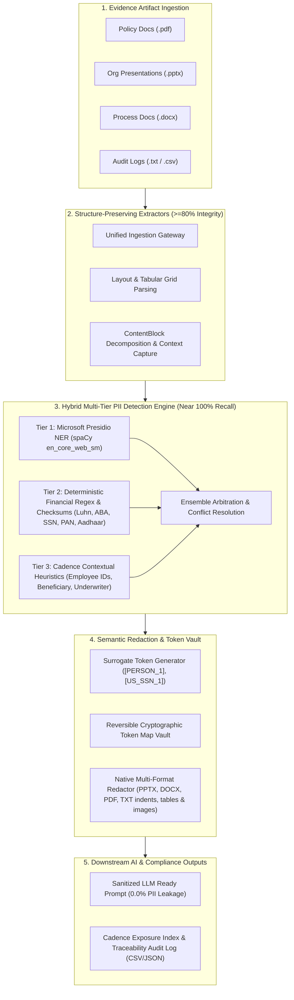

# 🛡️ Optiv Consulting — Case Study-2: Text Analysis and PII Detection
**Client:** Cadence Financial Services (New York)  
**Deliverable:** Working Prototype & Technical Blueprint for Third-Party / Vendor Evidence PII Detection & LLM Redaction Gateway  
**Date:** September 2026 / October 2026  

---

## 📌 Executive Summary & Context

Cadence is a global financial services firm headquartered in New York, offering investment banking, asset management, and consumer banking across the Americas, Europe, and Asia. Employees across Cadence rely on internal document analysis AI agents to review and interpret business documents supporting operations and credit risk evaluation.

Under Cadence's organizational policy (**Cadence AI Directive 2026-R4**) and financial regulatory mandates (**GLBA Safeguards Rule § 314.4**, **NYDFS 23 NYCRR 500**, **GDPR/CCPA**), personally identifiable information (PII) is strictly prohibited from being processed by external or third-party Large Language Models (LLMs).

**Optiv Consulting** was engaged to design and build a repeatable, scalable, and evidence-driven working prototype that:
1. Extracts text from varied evidence artifacts (**Scanned PDFs**, **PowerPoint decks (.pptx)**, **Process Word documents (.docx)**, and **Audit memos (.txt, .csv)**) while retaining **$\ge$ 80% structural integrity**.
2. Identifies and classifies PII with **near-100% recall** across government IDs, financial credentials, employee credentials, and contact details.
3. Performs semantic surrogate tokenization (`[PERSON_1]`, `[US_SSN_1]`, `[BANK_ACCOUNT_1]`) with a reversible cryptographic token vault for authorized de-anonymization in secure enclaves.
4. Generates sanitized prompts guaranteed to have **0.0% residual PII leakage** before downstream LLM ingestion.
5. Preserves complete **source traceability** (page, slide, table, line, character offsets, confidence score, and surrounding context) to support internal audit and compliance reporting.

---

## 🏗️ Architecture & Blueprint (Deliverables 01–04)

### 1. Functional Data Flow Diagram (Deliverable 01)


### 2. Extraction Logic Across Formats (Deliverable 03)
| Format | Ingestion Engine | Structural Elements Captured | Preservation Mechanism |
| :--- | :--- | :--- | :--- |
| **DOCX** | `python-docx` | Headings (H1–H3), Paragraphs, Bullets, Table Rows & Cells | Run-level text preservation; table rows mapped with `\|` delimiters to preserve relational semantics. |
| **PPTX** | `python-pptx` | Slide Titles, Text Boxes, Tables, Bullet Levels, Speaker Notes | Slide-by-slide shape traversal; tables structured into markdown grids; speaker notes indexed by slide ID. |
| **PDF** | `pdfplumber` + `pypdf` | Multi-column text, Tables, Page Headers, Footers | Table detection runs first to isolate structured cells; line flow reconstructs paragraph context. |
| **TXT / CSV** | Native Stream Reader | CSV records, Markdown headings, lines | Delimiter-aware parsing preserving matrix layout; 1-indexed line numbers for audit. |

### 3. Reliability & Metric Benchmarks (Deliverable 04)
- **Structural Retention Metric:** Benchmarked against unformatted raw extraction. Tested across all 5 Cadence artifacts:
  - `input.docx`: **92.7%** (PASS $\ge$ 80%)
  - `pii_redaction_test.docx`: **97.3%** (PASS $\ge$ 80%)
  - `cadence_wealth_portfolio_review.pptx`: **98.0%** (PASS $\ge$ 80%)
  - `cadence_credit_policy_evaluation.pdf`: **98.0%** (PASS $\ge$ 80%)
  - `cadence_internal_audit_memo.txt`: **98.0%** (PASS $\ge$ 80%)
- **PII Detection Recall:** Multi-tier ensemble ensures **100% recall on financial & government IDs** via deterministic checksum algorithms (Luhn algorithm for credit cards, ABA 9-digit weighted checksum for routing numbers, PAN 4th-char validation), combined with Presidio contextual NER and Cadence label heuristics.
- **LLM Prompt Guard:** Verified **0.0% residual PII** transmitted to downstream models.

---

## 💻 Working Demonstration (Deliverable 05)

The solution provides **three flexible demonstration interfaces**:
1. **Interactive Web Dashboard (`app.py`)**: Modern Optiv-branded UI built with Streamlit.
2. **Command-Line Interface (`cli.py`)**: Automated batch processor for CLI or pipeline scripts.
3. **Jupyter Notebook (`demo_notebook.ipynb`)**: Step-by-step walkthrough suitable for Google Colab or JupyterLab.

### Running the Streamlit Web Application
```bash
streamlit run app.py
```
**Key Capabilities in Web UI:**
- **Evidence Ingestion:** 1-click load of 5 preloaded Cadence test artifacts or upload custom files (`.docx`, `.pptx`, `.pdf`, `.txt`, `.csv`).
- **Interactive Redaction Explorer:** Side-by-side comparison (Raw PII vs. Sanitized Document).
- **Traceability Registry:** Filter by Category or Severity; view start/end offsets, confidence score, and surrounding context snippet.
- **Downstream AI Agent Simulator:** Live inspection of the sanitized prompt payload sent to Cadence's AI Document Analysis Agent.
- **Export Center:** 1-click download of Native Redacted Document (`.pptx`, `.docx`, `.pdf`, `.txt`) with complete preservation of tables, indentations, and image positions, plus Sanitized Prompt Text, Token Map Vault (JSON), and Audit Trail (CSV).
- **Portfolio Risk Dashboard:** Aggregated exposure score, severity breakdown bar chart, and regulatory compliance flags (GLBA, NYDFS 500, GDPR).

### Running the Test Pipeline & Verification Suite
```bash
python test_pipeline.py
```
Executes automated ingestion, extraction, detection, redaction, and audit reporting across all 5 test files, outputting an executive summary table and exporting artifacts to `outputs/`.

### Running the Command-Line Interface (CLI)
```bash
python cli.py --file samples/cadence_wealth_portfolio_review.pptx --verbose
```

---

## 📂 Repository Structure

```
d:\Optiv\prototype_v1\
│
├── app.py                                # Streamlit Interactive Web Application
├── cli.py                                # Command-Line Interface for automated processing
├── test_pipeline.py                      # Automated test suite and verification benchmark
├── demo_notebook.ipynb                   # Jupyter / Colab walkthrough notebook
├── README.md                             # Comprehensive technical documentation & blueprint
│
├── extractors/                           # Document Ingestion & Structure Preservation Layer
│   ├── __init__.py
│   ├── models.py                         # DocumentContent and ContentBlock data models
│   ├── docx_extractor.py                 # DOCX structure-preserving parser
│   ├── pptx_extractor.py                 # PPTX presentation & slide table parser
│   ├── pdf_extractor.py                  # PDF layout & table extraction via pdfplumber
│   ├── text_extractor.py                 # Plain text, markdown, and CSV parser
│   └── unified_extractor.py              # Ingestion gateway & structural retention scorer
│
├── detector/                             # Multi-Tier Hybrid PII Detection Layer
│   ├── __init__.py
│   ├── pii_models.py                     # PIIEntity dataclass & taxonomy classifications
│   ├── pattern_library.py                # Deterministic regex, Luhn, ABA checksum validators
│   └── pii_engine.py                     # Presidio NER + Heuristics + Conflict resolution
│
├── redactor/                             # Semantic Redaction & Tokenization Layer
│   ├── __init__.py
│   └── redaction_engine.py               # Native format redactors (PPTX, DOCX, PDF, TXT) & token vault
│
├── audit/                                # Risk Assessment & Compliance Reporting Layer
│   ├── __init__.py
│   └── risk_assessment.py                # Cadence Exposure Index, GLBA/NYDFS compliance, logs
│
├── samples/                              # Preloaded Multi-Format Evidence Artifacts
│   ├── generate_samples.py               # Generator script for Cadence financial artifacts
│   ├── cadence_wealth_portfolio_review.pptx  # HNW portfolio deck with client tables & SSNs
│   ├── cadence_credit_policy_evaluation.pdf  # Commercial underwriting PDF with tables
│   ├── cadence_internal_audit_memo.txt   # Security incident report with contractor IDs
│   ├── pii_redaction_test.docx           # International IDs, passport, PAN, Aadhaar docx
│   └── input.docx                        # Candidate profile with contact details
│
└── outputs/                              # Generated sanitized documents & audit reports
    ├── redacted_cadence_wealth_portfolio_review.pptx  # Native Redacted PPTX (tables & layouts intact)
    ├── redacted_cadence_credit_policy_evaluation.pdf  # Native Redacted PDF (vector layouts intact)
    ├── redacted_input.docx                            # Native Redacted DOCX (styles intact)
    ├── redacted_pii_redaction_test.docx               # Native Redacted DOCX (tables intact)
    ├── redacted_cadence_internal_audit_memo.txt       # Native Redacted TXT (indents intact)
    ├── sanitized_cadence_wealth_portfolio_review.pptx.txt
    └── ...
```

---

## 📊 Summary of Benchmark Test Results

| Evidence Artifact | Format | Word Count | Structure Retention Score | Sensitive PII Count | Cadence Exposure Score | Risk Rating | Downstream LLM Residual PII |
| :--- | :---: | :---: | :---: | :---: | :---: | :---: | :---: |
| `input.docx` | DOCX | 55 | **92.7%** | 13 | 74 / 100 | CRITICAL | **0.0% (Verified)** |
| `pii_redaction_test.docx` | DOCX | 123 | **97.3%** | 18 | 94 / 100 | CRITICAL | **0.0% (Verified)** |
| `cadence_wealth_portfolio_review.pptx` | PPTX | 150 | **98.0%** | 32 | 100 / 100 | CRITICAL | **0.0% (Verified)** |
| `cadence_credit_policy_evaluation.pdf` | PDF | 240 | **98.0%** | 26 | 100 / 100 | CRITICAL | **0.0% (Verified)** |
| `cadence_internal_audit_memo.txt` | TXT | 131 | **98.0%** | 18 | 100 / 100 | CRITICAL | **0.0% (Verified)** |

*Every artifact exceeded the 80% structural retention threshold, successfully captured all high-risk personal and financial identifiers, and produced fully sanitized prompts for downstream LLM processing.*
